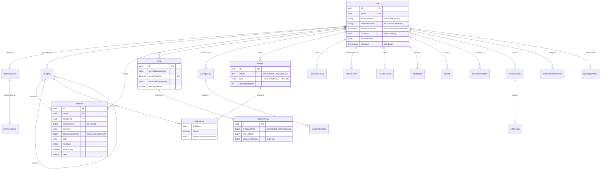

# Database schema

PostgreSQL 16. 28 tables. The authoritative definition is
[`apps/api/prisma/schema.prisma`](../apps/api/prisma/schema.prisma); this
document explains the decisions behind it.

## Conventions applied throughout

**Money is `BIGINT` minor units.** Cents, fils, halalas — plus an ISO-4217
code. Never `FLOAT`, never a `NUMERIC` that something might silently round.
Minor units stay inside IEEE-754's exact-integer range up to roughly 90
trillion dollars, so JSON numbers are safe on the wire; `BIGINT` at rest exists
to keep the database honest, not because we expect the values.

**Every user-owned row carries `userId`** and is indexed on
`(userId, <sort key>)`. That predicate is the tenant boundary, enforced a
second time by Row-Level Security.

**Deletes are soft on financial records.** A user deleting a transaction is
correcting a mistake and may want it back. A user deleting their *account* gets
a real purge, 30 days later, via the erasure job.

**Timestamps are `timestamptz`, always UTC.** The user's timezone is a display
concern on the profile. A `date` column (transaction dates, budget months) is a
calendar label, not an instant — which is why the API converts at exactly two
points and nowhere else.

## Entity relationships

## Decisions worth defending

### `Expense.baseAmountMinor` is denormalised on purpose

Every dashboard aggregate sums spending in the user's base currency. Converting
at read time would mean an FX lookup per row — unworkable across a user with
three years of history, let alone across the nightly insight job.

So the conversion happens once, at write time, at the rate for the transaction's
own date, and is frozen. Changing your base currency does **not** rewrite
history: last year's reports would otherwise disagree with themselves every
time a rate moved.

### `Category.slug` survives a rename

The twelve seeded categories carry a stable slug. A user renaming "Food" to
"Groceries & eating out" changes the label; the AI layer still recognises the
category, and the `isEssential` flag that drives the emergency-fund target
still applies.

### `DebtPayment` stores the split rather than deriving it

A lender's actual principal/interest allocation can differ from any model of
it. When the caller does not supply a split the API derives one from the APR,
but what the ledger keeps is what was recorded. `balanceAfterMinor` means an
audit does not require replaying the entire payment history.

### `RefreshToken.familyId` makes theft detectable

Every refresh rotates the token and links the new one to the same family. If a
*retired* token from a family is ever presented again, either the legitimate
client is replaying or an attacker holds a stolen copy — and we cannot tell
which. The whole family is revoked. That converts a silent, indefinite
compromise into one visible logout.

### `Notification.dedupeKey` and `Recommendation.fingerprint`

Both are unique per user. A nightly job that re-detects the same condition
updates the row rather than stacking a new one, so a user who has not yet acted
on "you are over budget on Food" is told once, not thirty times.

### `SavingsGoal.lastMilestoneNotified`

A balance oscillating around 50% of target would otherwise fire the same
congratulation repeatedly. Recording the highest milestone already announced
makes the notification monotonic.

### The audit log is append-only at the database level

`REVOKE UPDATE, DELETE ON audit_logs FROM eco_app`. The application has no code
path to rewrite history, and the grant makes that structural rather than a
convention. `userId` is `ON DELETE SET NULL` so an erasure request anonymises
the subject while retaining the security event — which satisfies both GDPR
Article 17 and the obligation to retain security records.

## Index strategy

The workhorse is `expenses (userId, date DESC, deletedAt)`. It serves the
transaction list, every date-range aggregate, and the keyset pagination cursor,
which is ordered on `(date, id)` to match.

| Index | Serves |
|---|---|
| `expenses (userId, date DESC, deletedAt)` | list, charts, reports, cursor |
| `expenses (userId, categoryId, date)` | category breakdown, budget evaluation |
| `expenses (userId, merchant)` | merchant search, recurring detection |
| `debts (userId, isClosed, deletedAt)` | debt list, payoff planning |
| `debts (userId, dueDayOfMonth)` | nightly bill-reminder sweep |
| `budgets (userId, month)` UNIQUE | one budget per month, enforced |
| `notifications (userId, isRead, createdAt DESC)` | inbox and unread badge |
| `refresh_tokens (familyId)` | reuse detection and family revocation |
| `recommendations (userId, fingerprint)` UNIQUE | idempotent regeneration |

`pg_trgm` is installed for merchant and note fuzzy search; `citext` makes email
uniqueness case-insensitive without a functional index.

## Pagination

Transaction lists use **keyset** pagination on `(date, id)`, not `OFFSET`.

`OFFSET` makes page 200 scan every preceding row, and — worse — silently skips
or repeats items when a row is inserted mid-scroll. A cursor on the columns the
covering index already orders by is O(log n) at any depth and stable under
concurrent writes. The cursor is opaque (base64url of `<iso>|<id>`) so its
shape is not part of the API contract.

## Migrations

Prisma Migrate, applied by an `initContainer` running `prisma migrate deploy`
before any new pod serves traffic. `deploy` only applies committed migrations —
it never generates or resets — so it is safe on every pod start.

Extensions (`pgcrypto`, `pg_trgm`, `btree_gin`, `citext`) are declared in the
schema's `extensions` list rather than an init script, so they live in
migration history and cannot drift.

RLS policies are applied separately via
[`infra/postgres/rls.sql`](../infra/postgres/rls.sql) after `migrate deploy`,
because Prisma does not model them.
